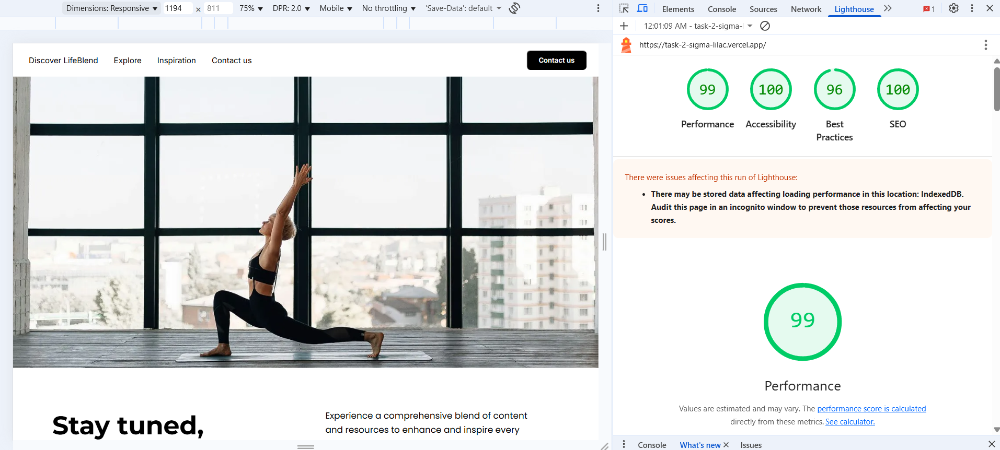
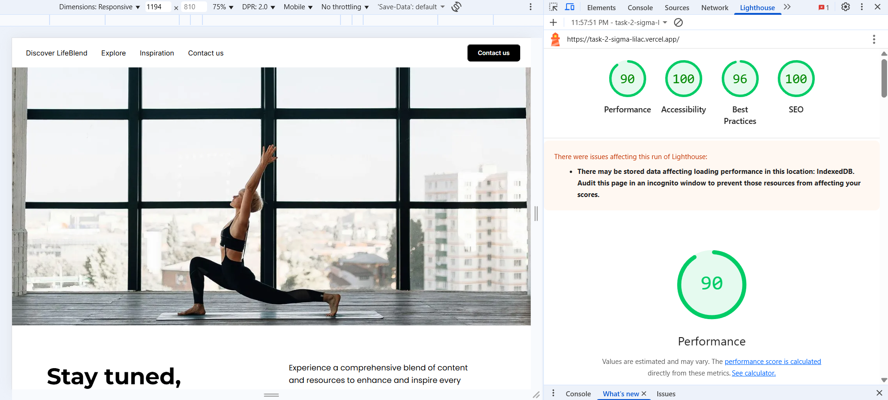
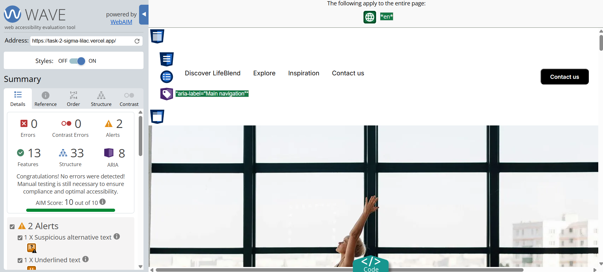
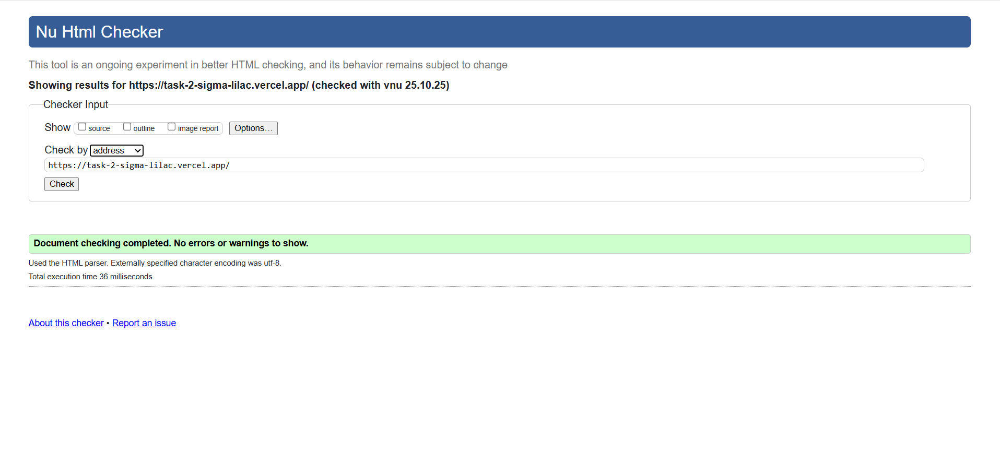

# Task 2 - Basics of layout and working with tools

Page built with HTML and CSS, following the provided Figma design specifications.

## 🔗 Links

[Figma Design](https://www.figma.com/design/FXH4IrR8Vho44BpcloBNfc/DEMO-for-Dima-Bukovsky?node-id=1-60652&t=WZgKLTdg4nKIjLJK-0)

[Live Demo](https://task-2-sigma-lilac.vercel.app/)

## 🚀 Getting Started

Follow these steps to run the project locally on your machine.

<br/>**Clone the repository**

```bash
git clone git@github.com:sergey-mikhovich/task-2.git
```

<br/>**Navigate to the project directory**

```bash
cd task-2
```

Open the index.html file in your preferred web browser.

## 📝 Performance & Accessibility Reports

<br/>**Lighthouse Audit Results**

Desktop:



Mobile:



<br/>**PageSpeed Insights**

Desktop:


Mobile:


<br/>**WAVE Accessibility Evaluation**



<br/>**W3C Markup Validation**

